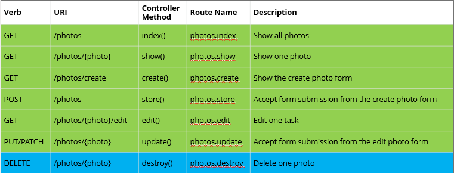
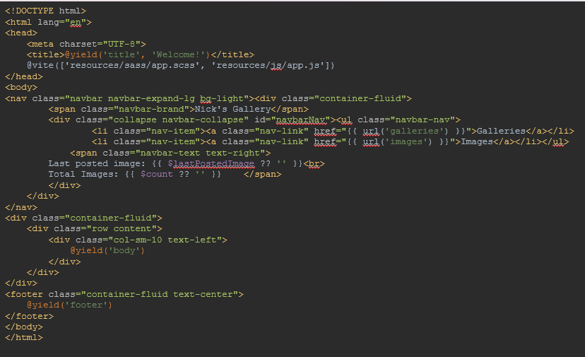

# LARAVEL FINAL EXAM 
## WEEK 9 

### Actions Handled By Resource Contoller


### Deleting Records 
- Delete records in laravel is similar to editing one 
- As per __REST__ principles, a delete action requires a delete method type 
- the delete method is named __destroy__

#### Route::delete
```
Route::delete('galleries/{gallery}', [GalleryController::class, 'destroy'])->name('galleries.destroy');
```
#### Delete Function 
```
public  function destroy(Gallery $gallery) {
    $gallery->delete();
    return redirect('galleries');
}
```
#### if you know the id 
```
public  function destroy($gallery) {
    $gallery->destroy($gallery);
    return redirect('galleries');
}
```

```
<form  method="POST" action="{{ route('galleries.destroy', $gallery->id) }}>
    @csrf
    @method('DELETE')
    <input type="submit" value="Delete">
    </form>
    <br>
```
- Update the Controller so only th authenticated can delete
```
class GalleryController extends Controller {
    public function __construct(){
        $this->middleware('auth', [except => ['index','show']]);
    }
}
```
### Soft Deleting Records 
- soft deletes allow you to archive your deleted items for later inspection or recovery 
- soft deletes mark database rows as deleted without deleting them 
- Eloquents soft delete function requires a __deleted_at__ column to be added to the table 
- once you enable soft deletes on that Eloquent Model, every query you write (unless you explicity add soft delete records) will be scoped to ignore softdeleted rows 

- You enable soft deletes by doing three things: adding a __deleted_at__ column in a migration, importing __SoftDeletes__ trait in the model and adding the __deleted_at__ column to your __$dates__ property 

#### Make soft delete Migration 
``` 
php artisan make:migration add_softdeletes_to_galleries --table=galleries 
```

- Theres a __softDeletes()__ method available on the query builder to add the __deleted_at__ column to a table 
```
return new class extends Migration {
    public function up(){
        Schema::table('galleries', function  (Blueprint $table){
            $table->softDeletes(); 
        });
    }

    public function down(){
        Schema::table('galleries', function   (Blueprint $table){
            $table->dropSoftDeletes(); 
        });
    }
}
```

- once you make these changes every __delete()__ and __destroy()__ call will now set the __deleted_at__ column on your row to be the current date and time instead of deleting that row and all future queries will exclude that row as a result 

```
use Illuminate\Database\Eloquent\Factories\HasFactory;
use Illuminate\Database\Eloquent\Model;
use Illuminate\Database\Eloquent\SoftDeletes;
    class Gallery extends Model {
            use HasFactory, SoftDeletes;
            
            protected $dates = ['deleted_at']; //mark this column as a date
            
            ...
    }

```

- you can include the list of soft-deleted items by using the __withTrashed()__ method 
```
    public function index(){
        $galleries = Gallery::withTrashe()->get();
        return view('galleries.index', compact('galleries'));
    }
```
- You can use the __trashed()__ method to determine if an instnace has been soft deleted 
- you can see a list of all soft-deleted items by using the __onlyTrashed()__ method

#### Restore 
```
public function restore($id){
    Gallery::withTrashed()->where('id', $id)->restore();
    return redirect('galleries');
}
```
#### Restore ALL soft deleted
```
Gallery::onlyTrashed()->restore();
```
#### Force Delete
```
public function forceDelete($id){
    Gallery::onlyTrashed()->where('id', $id)->forceDelete();
    return redirect('galleries');
}
```
#### Force Delete ALL soft deleted
```
Gallery::onlyTrashed()->forceDelete();
```

### Resource Routes 
- auto generate all associated routes ising the standard name method name convention in the contoller 
``` 
Route::resource('resource', controller) 

and 

php artisan route:list
```

- you can exclude any default routes 

``` 
Route::resource('photos', PhotoController::class, ['only' => [ 'index', 'show' ]]); 

Route::resource('photos', PhotoController::class, ['except' => [ 'create', 'store', 'update', 'destroy' ]]); 
```

### Migration Rollback 

- **Migration Steps**: Each time a migration is performed using the artisan command, a step counter is increased.
  
- **Rollback**: Allows you to undo the last x number of steps.
  
- **Reset**: Resets will completely drop and re-run ALL migrations. Note: rollback and reset actions are destructive, meaning that all records within the tables affected by the migration are destroyed.

---

#### Advanced Migrations

- **Modifying Tables**: To modify a table using a migration, use the following artisan command:
  ```
  php artisan make:migration migration_name --table=table_name
  ```

  
#### Migration Structures
  ```
  return new class extends Migration {
    public function up() {
        Schema::table('images', function (Blueprint $table) {
            $table->foreign('gallery_id')
                ->references('id')->on('galleries')
                ->onDelete('cascade');
        });
    }

    public function down() {
        Schema::table('images', function (Blueprint $table) {
            $table->dropForeign(['gallery_id']);
        });
    }
};
  ```
#### Disabling and Enabling Foreign Key Constraints 
```
Schema::enableForeignKeyConstraints();
Schema::disableForeignKeyConstraints();
```
### Database Seeding
- database seeding allows you to generate any number of "test" records in any or all of the tables 
- Laravel offers a utility called __Faker__ 
- __Faker__ is a package which allows you to generate various types of data such as people, addresses, phone numbers, lorem ispum text, payments, files & images and much more 

- Laravel offers a seeder class that calls other seeder classes 

- the __USER__ model contains the __HasFactory__ trait which allows the model to access __factory()__ method 

```
class User extends Authentcatable {
    use HasApiTokens, HasFactory, Notifiable

}
```
- Laravel uses __Factories__ to define the content of a generated record 
- A full list of information that can be generated can be found on the Faker website (https://github.com/fzaninotto/Faker)
```
class UserFactory extends Factory {
       public function definition() {
        return [            
          'name' => fake()->name(),            
          'email' => fake()->safeEmail(),
          'email_verified_at' => now(),
          'password' => '$2y$10$92IXUNpkjO0rOQ5byMi.Ye4oKoEa3Ro9llC/.og/at2.uheWG/igi', // password            
          'remember_token' => Str::random(10),
        ];
    }
}
```

- when generating multiple models worth of info, a seperate seeder class should be generated 

- To create image records you first need to create __ImageSeeder__ and override the __run()__ method to call the models __factory()__ 
    ```
    php artisan make:seed ImageSeeder
    ```

    ```
    namespace Database\Seeders;
    
    use Illuminate\Database\Console\Seeds\WithoutModelEvents;
    use Illuminate\Database\Seeder;
    
    class ImageSeeder extends Seeder {
        public function run() {
            \App\Models\Image::factory(10)->create();
        }
    }
    
    ```

- Must register the new ImageSeeder class in tthe autoloader   
    ```
    composer dump-autoload
    ```
- Next open the Database Seeder and add the following code 
    ```
    namespace Database\Seeders;
    
    // use Illuminate\Database\Console\Seeds\WithoutModelEvents;
    use Illuminate\Database\Seeder;
    use Illuminate\Support\Facades\DB;
    
    class DatabaseSeeder extends Seeder {
        public function run() {
            \App\Models\User::factory(10)->create();
            DB::table('images')->truncate();
            $this->call(ImageSeeder::class);
        }
    }
    
    ```

- create a new factory called ImageFactory 
- php artisan make:factory ImageFactor
```
php artisian make:factory factory_name 
```

- add the following to the __definition()__ method 
```
class ImageFactory extends Factory {
        public function definition() {
                    $galleryIds = \App\Models\Gallery::pluck('id')->all();
                    return [
                            'filename' => fake()->word . ".jpg",            'description' => fake()->sentence,
                            'gallery_id' => fake()->randomElemen($galleryIds)        
                        ];
                    }
                }

```

- FINALLY tell laravel to seed the database: 
```
php artisan db:seed 
```
- should appear like 
```
INFO  Seeding database.  

Database\Seeders\ImageSeeder .............................. 57.60ms DONE
```

### View Partials 
- Because of __CRUD__ in laravel it is common to have repetitive code 
- to use partials extract the duplicate code to a seperate file 
```
@if ($errors->any())
    @foreach ($errors->all() as $error)
        {{ $error }} <br>
    @endforeach
@endif
```
- the partial may now be referenced by using __@include__ 
```
    @include('partials.displayErrors')
```

### Sharing Data with all Views 
- sometimes you need to share data with every view 
    - header or footer 

#### Lets update the Master 
    
    

- Notice that we’re calling two variables $lastPostedImage and $count
- If the project is small enough that there will not be many share calls, the ideal provider is the __app/Providers/AppServiceProvider.php__

- with __AppServiceProvider__ you must first import the __View__ facade 


- anything in the boot will be excuted before teh view is rendered 


### View Composer 
- the second method of passing data to many views is __View Composer__ 